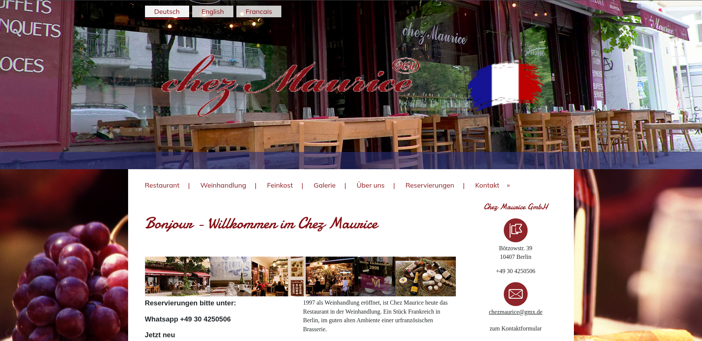
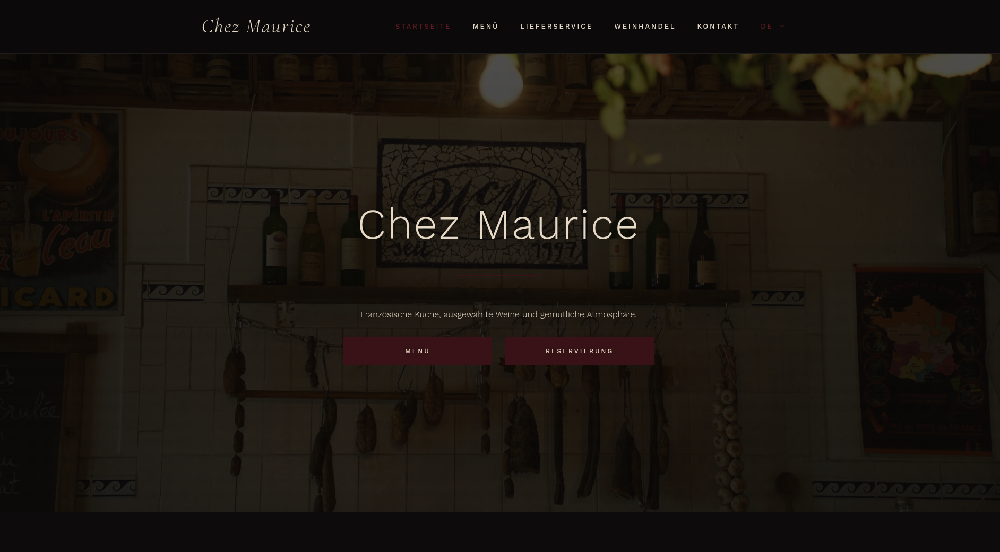

# Chez Maurice Restaurant Website

The current Website definitely needed some changes as we can see.
(At least some styling changes)
So my friend asked me if I could redesign the whole website.

Spoiler: I did it.



While I was working with WordPress for the first time (before I worked with Joomla CMS),
I started noticing that styling with a theme editor is not for me.
I felt like my workflow slowed more down then just typing manually CSS-Code.
In Conclusion, this project used GenerateBlocks as a basis and the styling was handed by written CSS-Code. No JavaScript.

## Insight



## Plugins

The project uses the following WordPress plugins:

* Chez Maurice Site
  Custom plugin for loading the external CSS file.
* GenerateBlocks
  Used for building flexible WordPress page layouts.
* Polylang
  Used for multilingual website functionality.
* Fluent Forms
  Used for contact and reservation forms.
* WP Mail SMTP
  Used for reliable email delivery from WordPress. (reservation delivery for owner)
* Five Star Restaurant Menu and Food Ordering
  Used for displaying restaurant menu and food-related content.
* Antispam Bee
  Used for spam protection.


## Project Structure

```txt
ChezMaurice
├── assets
│   ├── ChezMaurice.png
│   └── OldChezMaurice.png
├── config
│   └── ftp-secrets.fish
├── dist
│   └── custom.css
├── README.md
├── scripts
│   ├── build-css.fish
│   ├── deploy-css.fish
│   └── watch-css.fish
└── src
    └── css
        ├── 00-notes.css
        ├── 01-global.css
        ├── 02-header.css
        ├── 03-buttons.css
        ├── 04-hero.css
        ├── 05-introsection.css
        ├── 06-menu.css
        └── 07-contact.css ```


## Custom CSS Plugin

I used my Custom CSS Plugin.
More infos in [CSSPlugin](https://github.com/ImadsJourney/WP-Neovim-Script)
